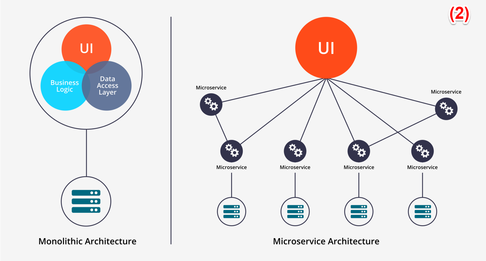

# Definition of Microservices

An architectural approach for developing a single application as a suite of small services,
each running in its own process and communicating with lightweight mechanisms.

- Think on process as for example a OS process.
- Think on communication mechanisms as for example HTTP.

Microservices are not new at all.

In my opinion, microservices is a architectural pattern based on services (SOA),
and when we think that SOA is death is because of we mainly think about SOA as the tools
we used to use to implement it i.e. Enterprise Service Bus. [(1)](https://iasaglobal.org/microservices-the-return-of-soa/)

Microservices are:

- Individually deployable components
- Organized around business capabilities (DDD)
- Decentralized data management (each microservice has its own data)
- Each microservice can be designed differently i.e. programming language, data model, data storage.
- Easier to evolve, as we will be able to develop and deploy each component independently

