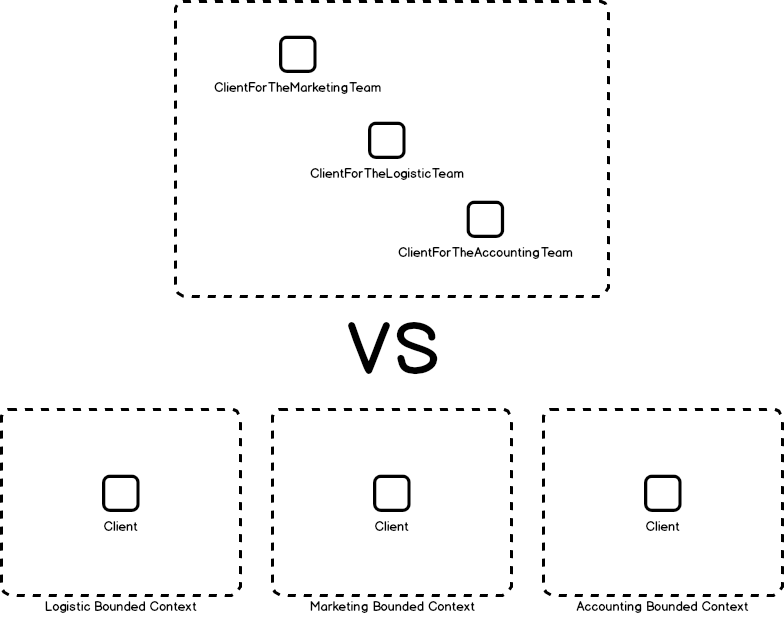

# Domain-Driven Design

To me **Domain Driven Design** is a software modeling/design approach that help us to:

1. reduce the complexity of our software
2. discover the core model of our system
3. and finally and most important, at least to me, DDD help us to understand the problem we as software engineers will help to solve

Our job as software developers is to solve problem (when we are not saying inappropriate comments of course)
and the problem we help to solve are in the core of other people job/life. So before even trying to get a
a perfect software architecture design we MUST understand the problem we will help to solve, and there is no
better way to do so than listening to the people who lives in their day-to-day with such a problem, the domain experts.

## DDD-dictionary

- Domain: a subject matters that we are building software on. Sphere of knowledge to which users apply the software
- Entity: a unique thing that has a life cycle and can change state, it carries a concept of identity
- Value:  an immutable object that describes some characteristic or attribute but carries no concept of identity
- Repository: mechanism for encapsulating storage, retrieval, and search behavior which emulates a collection of objects
- Service:  an operation offered as an interface that stands alone in the model, with no encapsulated state
- Aggregate:  a cluster of domain objects that can be treated as a single unit to provide a specific functionality and for the purpose of data changes. An aggregate will have one of its component objects be the aggregate root

## Bounded Context

Bounded contexts are the Single Responsibility Principle applied to your domain model.
Each part of your system has its intelligence, data, and vocabulary.
Each part is independent of one another.

## Why pairing DDD and MSA (Micro-services Architecture)

DDD and MSA make such a great couple because of:

1. DDD places the focus on the business domain so it can help us define the boundaries of responsibility for each micro-service
2. and because of DDD make a huge emphasis in communication it can help to model the organization we are trying to help

---

1. [What is DDD?](http://dddcommunity.org/learning-ddd/what_is_ddd/)
2. [Domain Driven Design: The Good Parts - Jimmy Bogard](https://www.youtube.com/watch?v=U6CeaA-Phqo)
3. [Event Storming](https://www.eventstorming.com/)
4. [Tackle Business Complexity in a Microservice with DDD and CQRS Patterns](https://docs.microsoft.com/en-us/dotnet/standard/microservices-architecture/microservice-ddd-cqrs-patterns/)